```{r setup, include=FALSE}
knitr::opts_chunk$set(echo = TRUE)
```
wiseR is an interactive,end-to-end Bayesian Network Analysis and publishing platform for learning cross-validated structure, inferences, topology, visualization in interventional and observational data. It is powered by shiny, bnlearn and visNetwork packages.

# Getting Started
To install latest developmental version of wiseR in R

```c
devtools::install_github('SAFE-ICU/wiseR')
```

To launch the app:

```c
wiseR::wiser()
```
# Bayesian Networks

## Why Bayesian Networks?


A network is one of the most intuitive representation of complex data. However, most networks rely on pair-wise associations which limits their use in making decisions. Bayesian Networks (BNs) are a class of probabilistic graphical models which can provide quantitative insights from data. These can be used both for probabilistic reasoning and causal inference depending upon the study design.

A BN is a directed acyclic graph and provides a single joint-multivariate fit on the data with a list of conditional independencies defining the model structure. Unlike multiple pair-wise measures of association, fitting a model decreases the chance of false edges because the structure has to agree with global and local distributions. Importantly, unlike most other forms of Artificial Intelligence and Machine Learning, BNs are not a black-box model. These are transparent, interpretable and help the user in reasoning about the data generative process by looking at the motifs. This can be immensely useful in learning systems such as healthcare where a feedback between the clinicians and the learning system is paramount for adoption. The structure (independencies) of a BN can be learnt directly from data using machine learning or be specified by the user, thus allowing expert knowledge to be injected. After the dependence structure within the data is learnt (or specified) the parameters are learnt on the network using one of many possible approaches. wiseR provides most of the existing approaches such as constraint based algorithms and score-based algorithms for parametrization of the Bayesian Network. Recommendations as per the state-of-the-art in the literature are specified at each step of the BN learning process (i.e. the recommendatin of score based algorithms over constraint based algorithms for learning structure and Bayesian Information Criteria over Akaike Information Criteria for evaluating the fit). Parametrization of the network enables predictions and inferences. These inferences can be purely observational ("seeing" the state of a variable and its effect on neighbours) or causal ("doing" something to a variable, i.e. interventions and observing the effect on downstream nodes). wiseR provides scoring methods both for observational (e.g. Bayesian Information Criterion) and interventional (e.g. modified Bayesian Dirichlet Equivalent score) datasets.  

The flexibility provided by BNs in probabilistic reasoning and causal inference has made these one of the most widely used artificial intelligence methods in Computer Science. However, the sophistication required to code all the features has limited their use by domain experts outside of computer science, e.g. clinicians. wiseR plugs this gap by creating a GUI for the domain experts and is an end-to-end solution for learning, decision making and deploying decision tools as dashboards, all from the wiseR platform.

## What do the motifs (junctions) reveal about the data-generating process
Carefully learnt BNs are representations of the generative process that produced the data. These generative processes are captured in the the form of three primary motifs present in the network: chains, forks and colliders. 

### Chains or Mediators
This motif is the simplest structure in a BN with a sequence of nodes pointing in the same direction. The intermediate nodes are called mediators and conditioning on any of the mediators makes the flanking nodes independent of each other. A mediator can be thought of as a mechanism, hence capturing the information about mechanism removes the need for capturing the triggering process, hence making the triggering process independent of the outcome.  

### Fork or Confounders
The second type of structure observed in a BN is a common parent pointing towards two or more child nodes. The parent represents the common cause and not accounting for the parent is a common source of error (confounding) in many statistical models built upon real world data. A folk example of such an effect is Age as a confounder (common cause) of IQ and shoe-size in children. Failure to condition upon age will lead to a spurious correlation between the IQ and shoe-size and change our reasoning (hence predictions) about the system being modeled.

### Collider or a V-structure
These are one of the most interesting motifs in an Bayesian Network and are indicated by two nodes pointing towards a single child node. Although the two parent nodes are not causally connected, conditioning on the state of the common child opens up a ghost-path for probabilistic inference flow (inter-causal reasoning) which can explain many intriguing paradoxes (e.g. the Monty Hall problem). 


# Walkthrough of wiseR functionalities

## Pipeline


## Start

On launching the App we are greeted with the home page.The app then starts initializing UI components which may take 1-2 seconds. First time launch may experience more delay as the app checks and installs all the necessary dependencies required. 

Clicking on start analyzing redirects us to the main page, containing app utilities in a tab fashion.

The ordering of the tab has been maintained in a left to right fashion based on flow of use in bayesian learning. The main page has 5 tabs named 'App Settings','Data','Association Network','Bayesian Network' and 'Publish your dashboard', each tab covering a specific functionality.

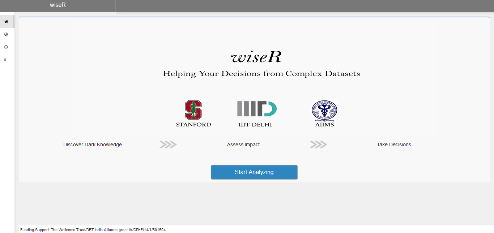

##App Settings

This tab is used to set the computational settings of the app. Bayesian learning on complex data is often computationally expensive and time consuming, thus we enable the user to run computationally expensive processes in parallel, and also to choose the number of clusters (Parallel nodes) to form which they can select based on their hardware.


## Data

This tab is used to load, pre-process and explore the dataset user wants to work with before learning begins.

The dataset panel contains the upload and preprocess menu while explore panel is used to visualize the distribution of the data.

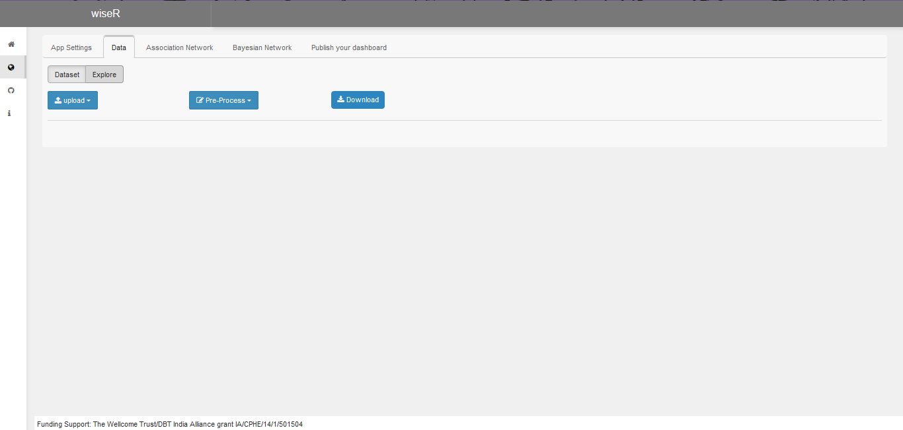

### Upload

Using upload menu user can either load pre-existing data or upload data of their own. Available file formats of data are '.CSV','.RData' & '.txt'. For '.txt' files different options of file formatting are provided such as:

* Comma Separated
* Semi-colon Seperated
* Tab separated
* Space Separated

The default setting of the app is to consider variables in the dataset as factors by default. This can be un-selected based on user need.

Current limit of file upload is 8000 mb, however it is recommended to use .RData for large datasets.

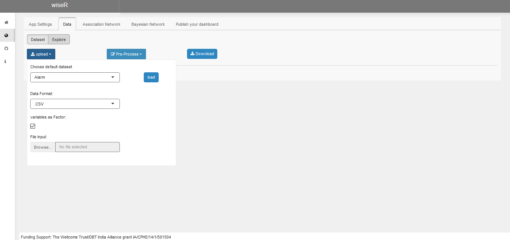

### Pre-process

The preprocess menu is used to edit the data before using through the app. It is essential that data is discrete and complete for learning association network and bayesian network. Multiple options to pre-process the data have been provided.

* User can convert any variable which has been misclassified as numeric to factor
* User can convert any variable which has been misclassified as factor to numeric
* User can choose from a number of algorithms to discretize their data -                       Hybrid(Recommended),Hartemink(Recommended),K-means,Quantile,Frequency,Interval
* Hartemink requires 2 parameters 'break' and 'ibreak' which can be passed using the text input boxes.
* user can also transpose their data frame, which is especially useful in case of gene expression data
* User is also given the option to sort the columns of data alphabetically
* User can also select unnecessary variables and delete them from the data using the delete button. A rest button is also provided to undo the delete operations in case of mistakes.
* Option for adjusting the learning for interventional data is also provided. User can simply select the variable which holds the interventional classification and adjust the learning to it.

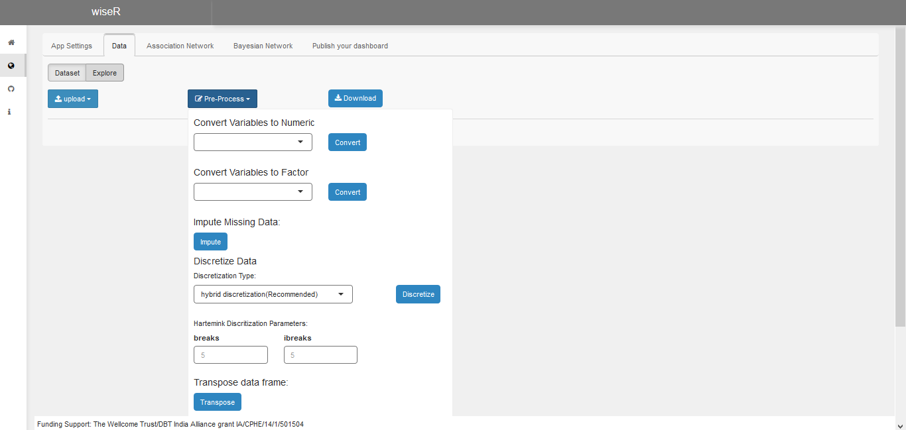


### Download

This button is provided in case the user wants to download the dataset in current state as a .CSV file

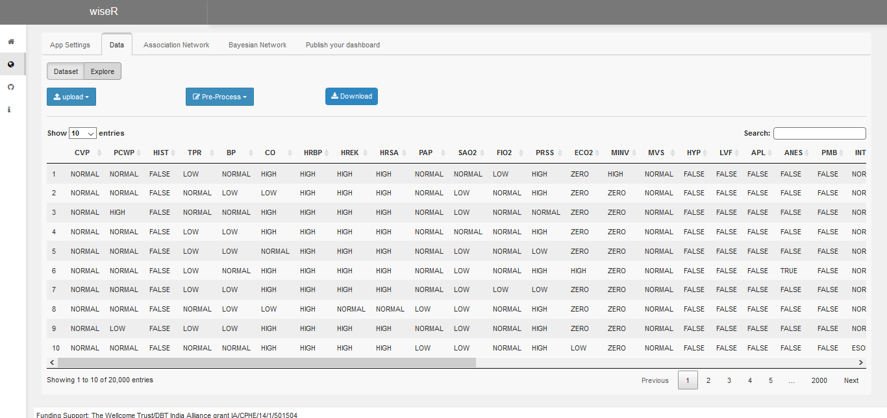

### Explore


This section is provided to visualize the distribution of the variables in the dataset.
Once the data has been pre-processes(Discretized and complete), the user can select a variable and visualize the plot of its factor distribution.

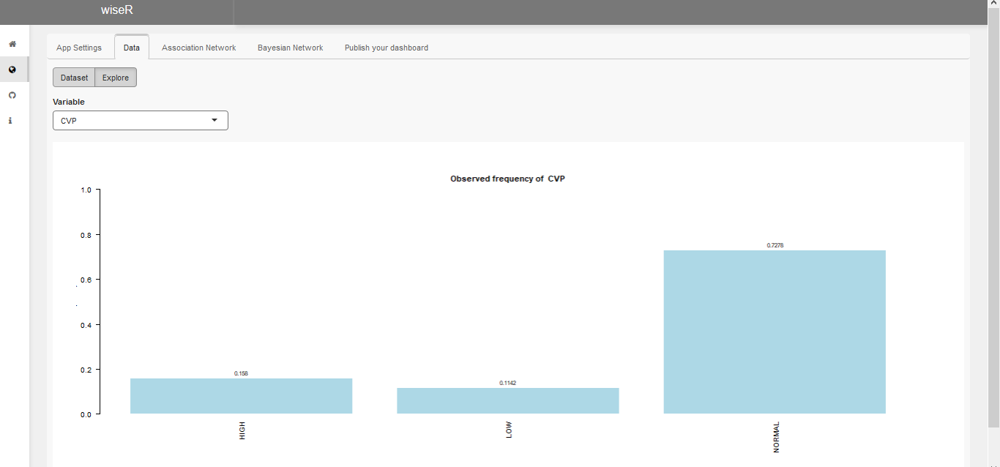

## Association Network

Even though not directly related association networks are an essential part of bayesian learning. Bayesian networks are often large and complex, which makes the difficult to understand. Learning association networks on the data before bayesian learning can give useful insights from the simplistic structure produced and provides a more targeted approach to bayesian learning.

The app provides multiple options to build and explore association networks.

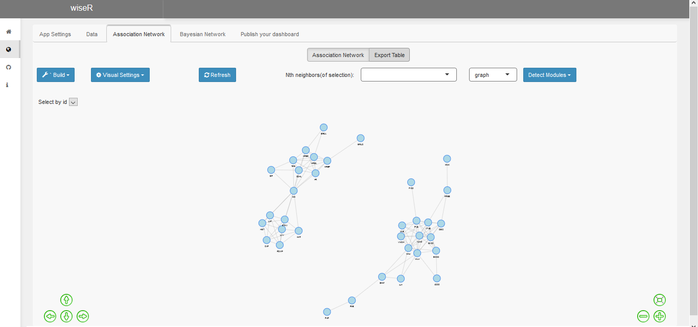

### Build


The build menu is used to build association networks. It consists of different metrics for association strength which are used to build association networks like

* cramer's V(Recommended)
* cohen's D
* Goodman kruskal lambda
* Tschuprow's T

Each method returns a value between 0 and 1. 0 being two variables are not associated and 1 being highly associated. A threshold value between 0 and 1 can then be set to choose the edges that remain in the association graph based on strength of association.

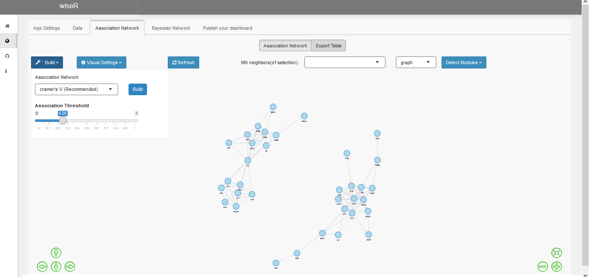

### Detect Modules

Often large graphs are difficult to explore and contain redundant information. To enable a clutter less analysis feature for module/community detection is provided which highlights different important groups of subgraphs in the original graph. These graphs can be individually explored and analysed.

There are different clustering algorithms available in the app for module/community detection which is powered by linkcomm package, like ward.D (Recommended),ward.D2,single,complete,average,mcquitty, median,centroid for user to choose from.

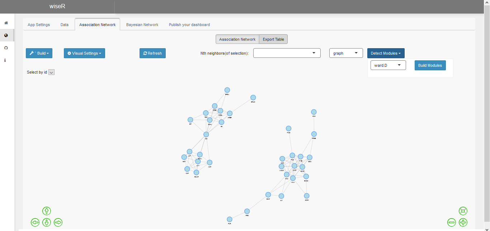

### Visual settings

The visual settings menu is used to exploit the graph for better exploration. It comes equipped with many features like variable grouping, which enables the user to group different nodes, by selecting variable names/vector of variable indices/variables belonging to a module and selecting a node shape they want to give these variables.

To ease the exploration of large graphs a threshold for visible neighbor chain is provided, such that clicking on a node only display its neighbors upto that degree.

Another neighborhood variable exploration mechanism is setting value for nth order neighbors, such that clicking on a variable return a list of nth degree neighbors.

User  has the option to arrange the graph nodes using different graph layouts.Depending on the graph different layout setups enable ease of exploration. Some useful layouts include mds, tree, sugiyama

User can adjust the font size of the node labels to improve visibility

User also has the option to download the network graph in its current state using the save network option present in the bottom right corner of the graph.

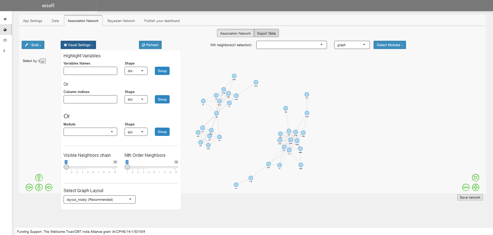

### Export tables

This section is used to visualize the association network produced in a tabular form and also to download it as a .CSV file if needed.

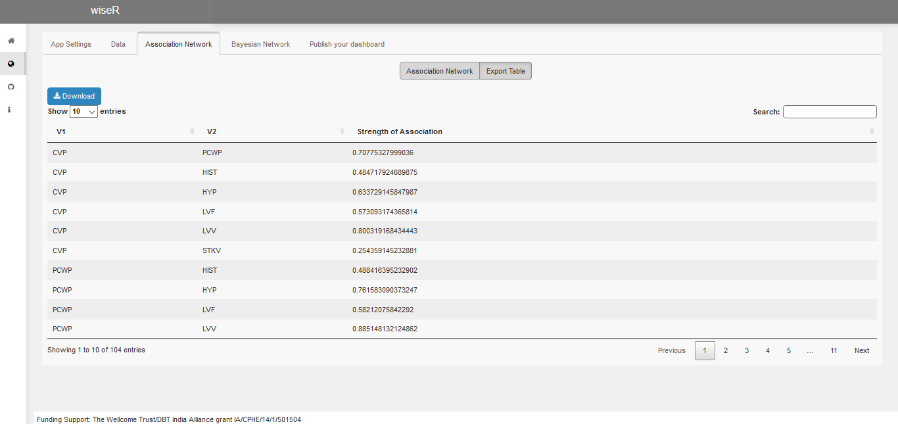

## Bayesian Network

Multiple features have been clubbed into the bayesian learning component of the app to make it as useful as possible. This component of the app is powered by the bnlearn package and tries to cover all the innovative and efficient methods for structure learning as explained in the book.

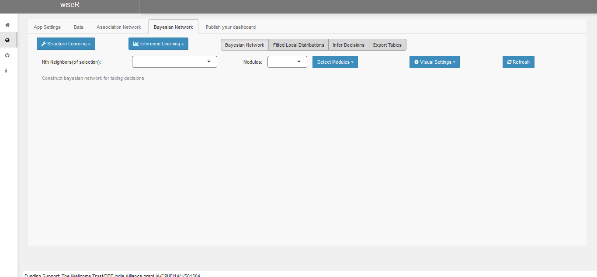

### Structure learning
The structure learning menu incorporates all the need for bayesian learning and has been divided into 5 sections based on use.

#### Initialize structure

This section enables the user to upload a network graph as a .CSV file to initialize the bayesian learning graph. The section also provides the user the option to add, remove or reverse the direction of any arc, once the graph has been uploaded. (Only used in score-based learning)

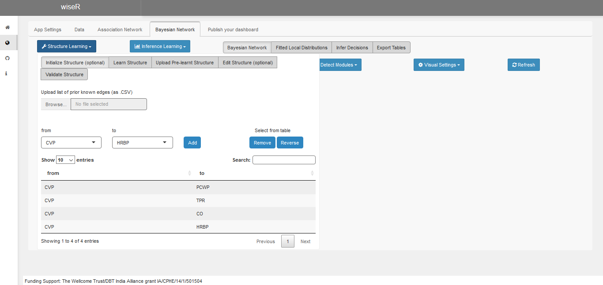

#### Learn Structure

This section is used to learn new bayesian structure through the app.

The user can choose from a number of bayesian learning algorithms such as

* Score-based (Recommended):- Hill Climbing, Tabu
* Constraint-based:- Grow-Shrink, Incremental Association, Fast IAMB, Inter IAMB,PC
* Hybrid Learning:- Max-Min Hill Climbing, 2-phase Restricted Maximization
* Local Discovery:- Max-Min Parents and Children,Semi-Interleaved HITON-PC, ARACNE, Chow-Liu

and can also adjust other bayesian learning parameters such as:

* Parameter fitting algorithm:- Bayesian parameter estimation, maximum likelihood parameter estimation
* Network score:- Bayesian Information Criterion,Bayesian Dirichlet Equivalent,modified Bayesian Dirichlet Equivalent,log-likelihood,Akaike Information Criterion,Bayesian Dirichlet Sparse,Locally Averaged Bayesian Dirichlet (Only used in score-based learning)
* Imaginary sample size (Only used in score-based learning)
* Blacklist(explicitly restrict edges in structure learning) and whitelist(explicitly enforce edges in structure learning) edges by uploading a .CSV file for the same
* Disabling data resampling in bootstrap learning. This is particularly useful for data with very less no. of samples, such that resampling may lead to information loss.  This method is only possible for score based algorithms as it requires random graph initialization.
* Bootstrap iterations:- No. of bootstrap iteration to run in case user decided to opt for bootstrapped structure learning
* Bootstrap sample size:- Proportion of data to be used as sample for bootstrap learning
* Edge strength:- Set a threshold value between 0 and 1 to remove edges below that strength from the final structure. Edge strength is basically the probability of occurrence of an edge in each iteration of bootstrap learning
_ Edge direction:- set threshold value between o and 1 to remove edges below that direction confidence from the final structure. Edge direction is basically the confidence of direction of a learned arc in bootstrap learning.

The user can simple choose the do direct learning or do a bootstrapped one(in which case bootstrap parameters will be used) for more robust structure learning.

Once structure has been learned, parameters such as parameter fitting algorithm and edge strength and direction threshold(For bootstrap learning) can be adjusted without having to re learn the structure through parameter tuning option.

User can also save the learned structure as a bnlearn object in .RData format through the save option.

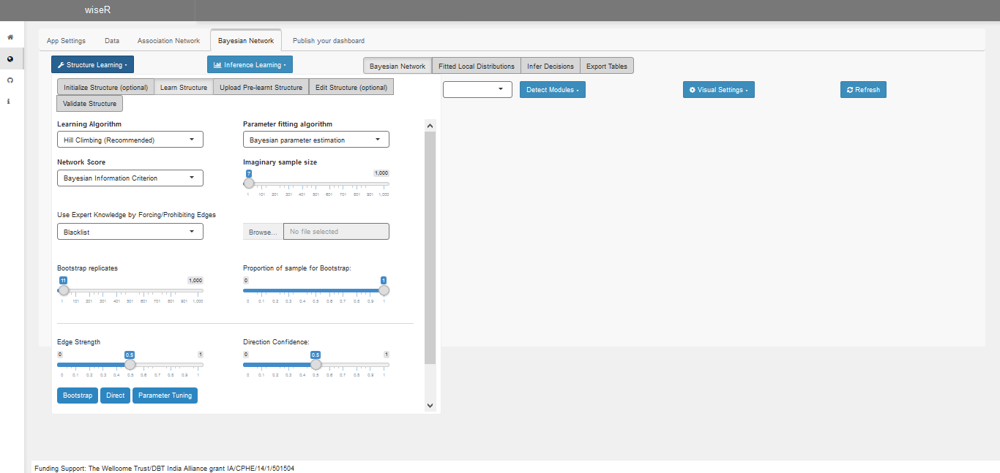

#### Upload pre-learnt structure

This section enables the user to upload an already bayesian structure to be explore through the app. This save the user hassle of learning the structure again and again. The upload structure has to be a bnlearn object uploaded as a .RData file.

User has option to upload both simple and bootstrap structure and adjust there parameters accordingly

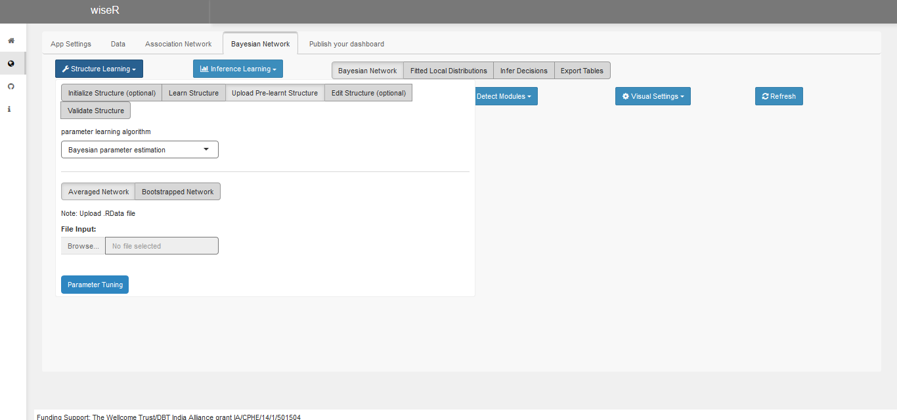

#### Edit structure

This section enables the user to edit the structure after learning to incorporate additional expert knowledge. User can add new arcs to the structure and remove, reverse the existing ones.

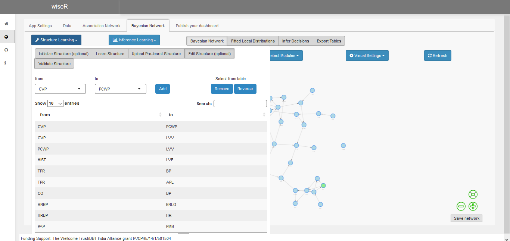

#### Validate structure

This section enable user the option to validate the learned structure, and check the accuracy of the network. User can choose various parameters such as

* Parameter fitting algorithm
* Network score
* Loss function
* Validation algorithm:- 10-fold, Hold-out

to validate the network. The log-likelihood loss and network score outputs produced can then be used to judge the usability of the learned structure.

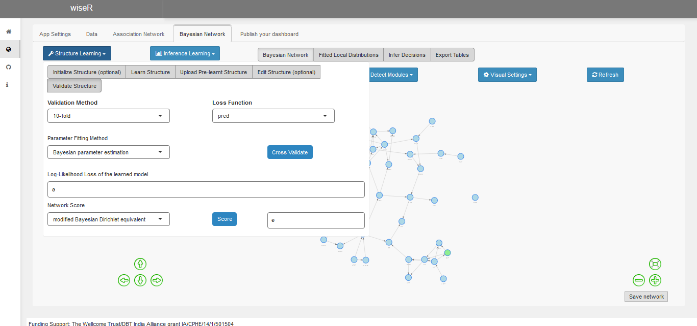

### Inference Learning

The inference learning menu enables the user to learn and explore conditional probability plots on the learned structure. The user can set an event  and multiple evidences can be inserted and removed as per need. This crucial feature enables the user to explore probability plots on event nodes in the network conditionalized on chain of evidences, which is the essence of decision making through bayesian networks.

The app provides 2 means for inference learning

* Approximate (Very fast but sampling based inference, thus varying results on each iteration leading to slightly less accurate probability plots)
* Exact inference (Fast for small networks, slow for large networks but accurate results on each iteration)

While the app learns approximate learning as default, user must explicitly learn exact inferences whenever the structure is learned or updated. The user can than enable exact inferences instead of approximate.

To compensate for wavering accuracy of approximate inference while retaining its speed, option for inference with error bars is given. User can provide the no. of iterations for error plot (Recommended 25). It is observed that the inference plots produced using approximate inference with error bars, is almost as accurate as exact inference, without the time constraint of exact inferences on large networks.

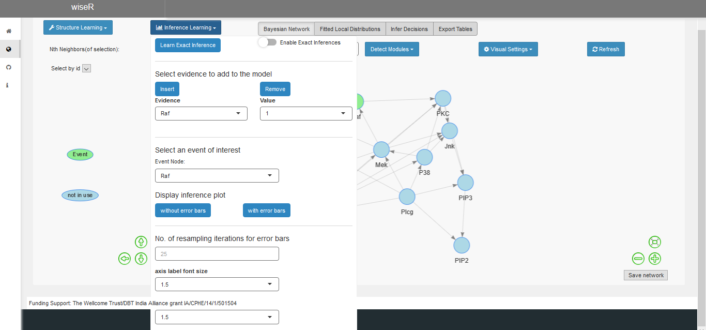

Apart from structure learning and inference learning the bayesian network tab is divided into 4 sections for visualization and exploration


* Bayesian network panel is used to explore the learned structure and is equipped with all the graph exploration features as available in association graph

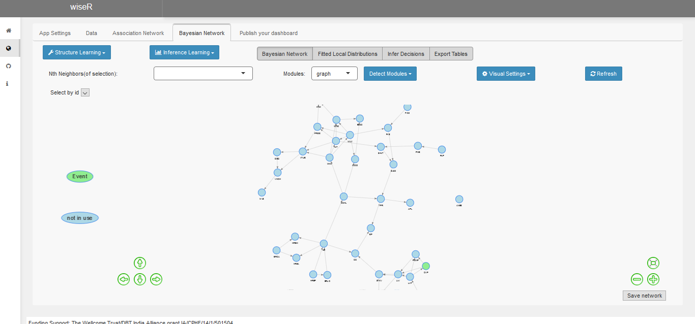

* Fitted local distribution panel is used to explore the local probability distribution tables of variables in the learned network structure

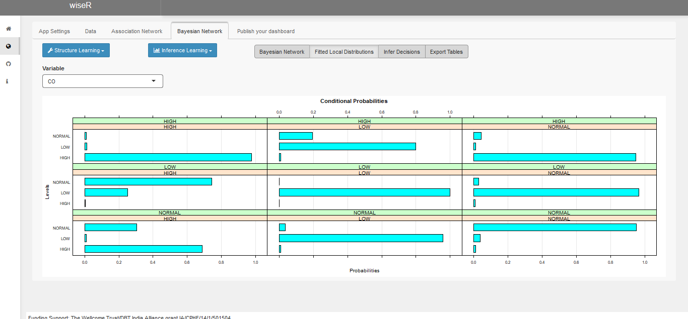

* Infer decisions is used to visualize the inference plots once the user has chosen the event and evidence nodes. It also has option to sort the plot axis and prune the no. of plot bars

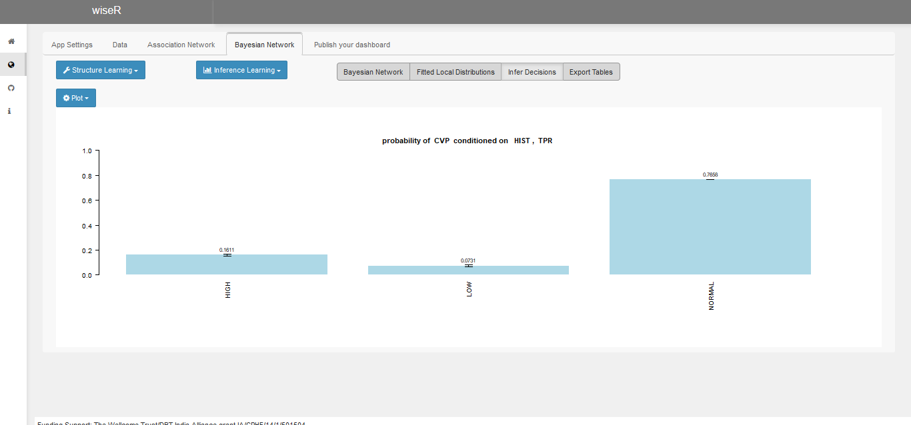

* Export tables section is used to visualize the network graph, blacklist-whitelist edges and variable wise validation results in tabular format. User can also download these tables as .CSV file

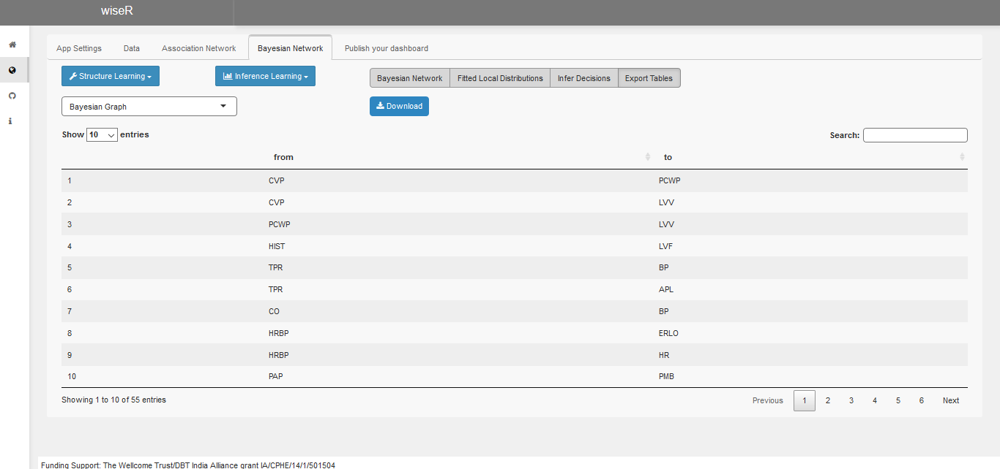

## Publish your dashboard

This section is one of the key highlights of the app. Often user find it difficult effectively communicate their results on bayesian learning. This app enables the user to produce a custom dashboard of their results as an R package.

The user has options to select the name and theme for the dashboard, the app simply builds the dashboard for them which is downloadable as an R package through the app. The custom dashboard is equipped with flagship features of wiseR like the interactive graph exploration and inference learning and visualization.

This feature save author hassle of creating a dashboard for their findings, and helps propagating research output to the community in an efficient manner, which is the main motive behind wiser i.e bridging the gap between the research community and technology.


# Comparison

We draw a simple comparison of the wiseR app with existing bayesian learning and present it in the table below

Table Key:
* Open source (OS): Is the source code available ? If yes what programming language?
* Target Audience (TA) :What is the target audience? Based on the source code availability and programming language used, the app can be target to end user, data scientist or both.
* Enabled Statistical/ML extensions (MLE) : Does the backend language supports AI/ML libraries for customizations in those directions?
* Structure Learning (SL): Is structure learning possible?
* Bootstrapped Learning (BL): Is robust bootstrap structure learning possible?
* Interventional Data(INT): Can it handle interventional data and incorporate it in structure learning?
* Cross Validation(CV): Does the app provides means for cross validation and evaluation of learned models?
* Parameter learning(PL): is parameter learning possible using the app?
* Informed Layout(IL): is network visualization using a wide variety of efficient and targeted graph layouts for exploration ?
* Community Detection(CD) : are subgraphs based on communities/modules detected in the graph using available for visualization and exploration?
* Inference with Confidence (IC): Can the app perform inference learning with confidence intervals ?
* Chained Inferences(CI): can the app handle multi-evidence inference learning?
* Exact Inference(EI): can the app perform exact inference learning?
* Approximate Inference with error bars(AIE): can the app perform much faster approximate inferences, verified over multiple iteration and produce final results with error bars(Much faster and equally accurate than exact inference on large datasets)?
* Parallel processing(PP) : Does the app enable the user to run the process in parallel for faster runtime?
* Free: Is the app free for public use?


```{r, include=FALSE}
table = read.csv('comparison.csv')
```
```{r,echo=F,results='asis'}
knitr::kable(table,caption = 'A comparison of wiseR and other bayesian learning apps')
```


# Example
We explain the usefulness of bayesian networks by replicating the results presented in Sachs et al. (2005), which utilizes bayesian learning on complex interventional data.

We upload the sachs interventional data which is in a space separated text file into the app.
Variables are read as factors as it is a numerically encoded discrete data.

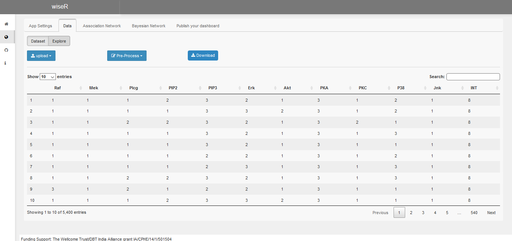

The variable INT holds interventional information, adjustment is made for the same in the preprocess menu. This will now be used as a part of bayesian structure learning.

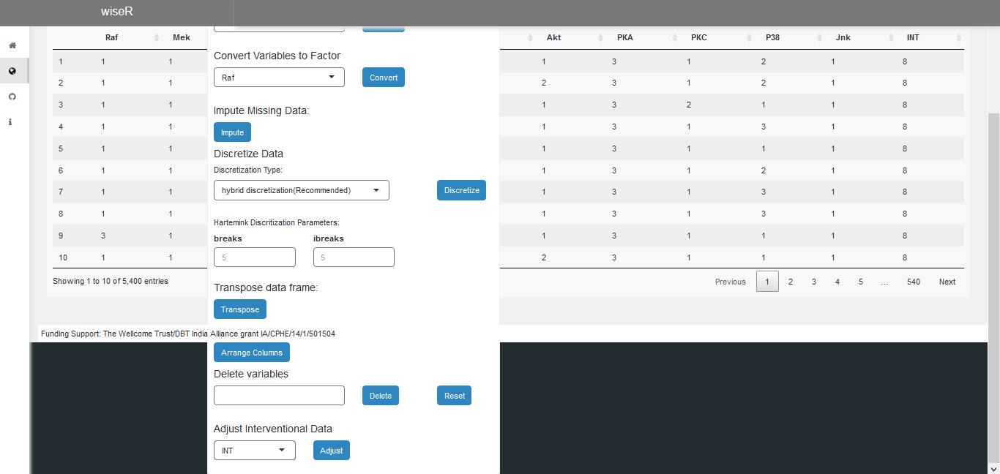


We now learn a simple bayesian network on the data using Hill climbing algorithm and mbde network score. This graph will now be used to initialize structure learning using tabu algorithm. This mechanism of graph initialization in structure learning is especially useful in score-based learning like Tabu, which prevents it from getting stuck in local maxima.

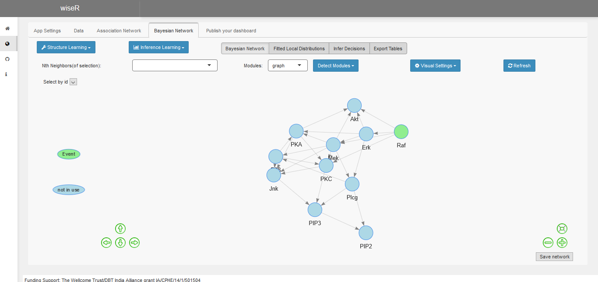


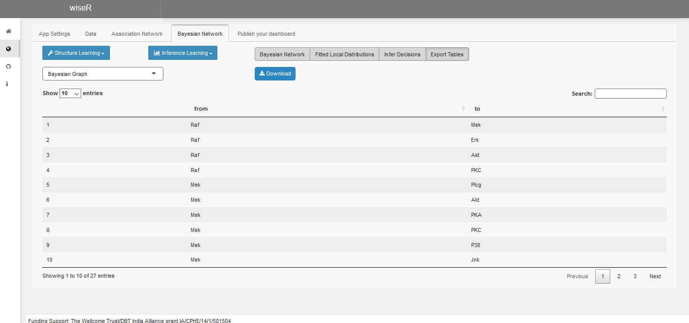


We now upload the graph as initialization for structure learning.

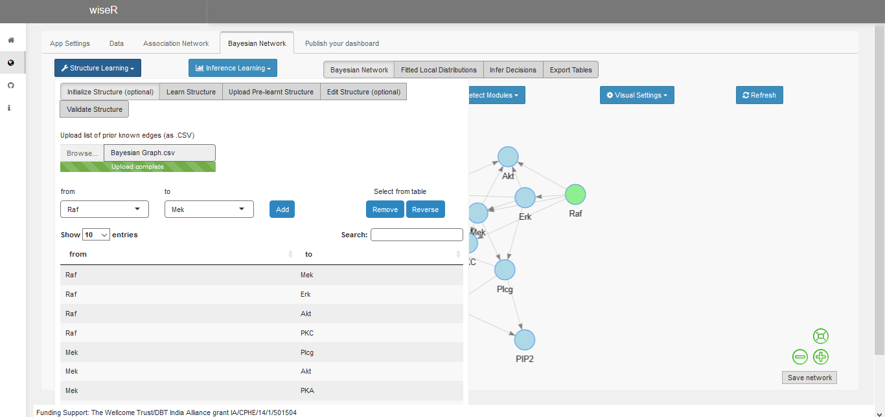


We now set the appropriate parameters for structure learning.
* Algorithm: tabu
* Network score: modified bayesian dirichlet equivalent
* ISS(imaginary sample size): 15
* Parameter fitting algorithm: bayesian parameter estimation

We perform a simple bayesian learning using tabu, to replicate the results. User can select the bootstrap parameters and do a bootstrap learning, to produce more robust structures.

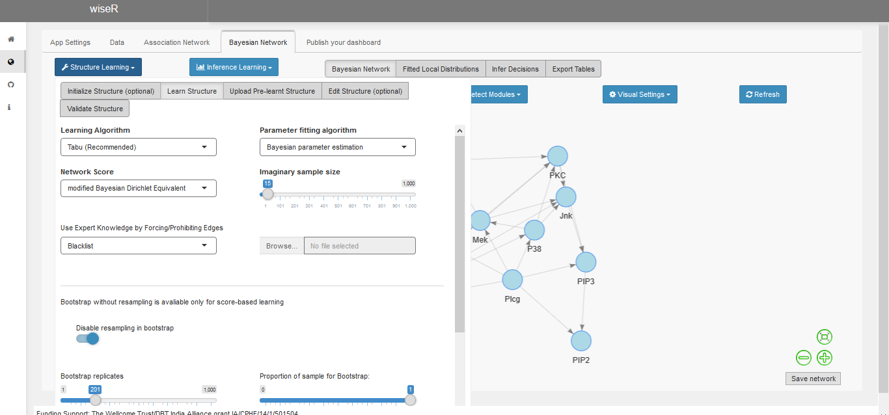


As we can see, the final produced structure has all the validated arcs that are present in the original paper even though a few have been reversed. The structure contains some unvalidated arcs as well which were discovered in the original paper but discarded due to low confidence.

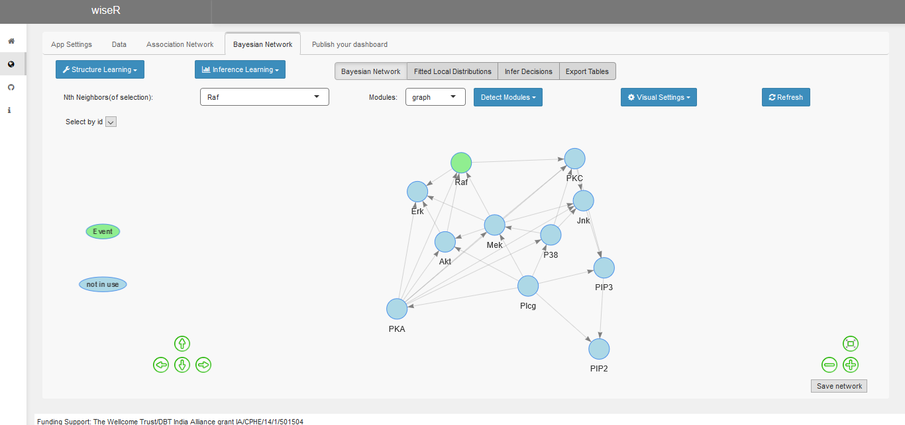

We now confirm exact inference results with approximate inference with error bar to show that the unique approximate inference mechanism provided in the app produces as accurate results as exact inference without computational constraints in case of large structures. For this purpose we set the node 'Akt' as event conditional on 'Erk = 1'. In the probability plots produced we can clearly see that approximate inference with error bars produces as accurate results as exact inference within 0.05 range of error, which is negligible


Exact Inference
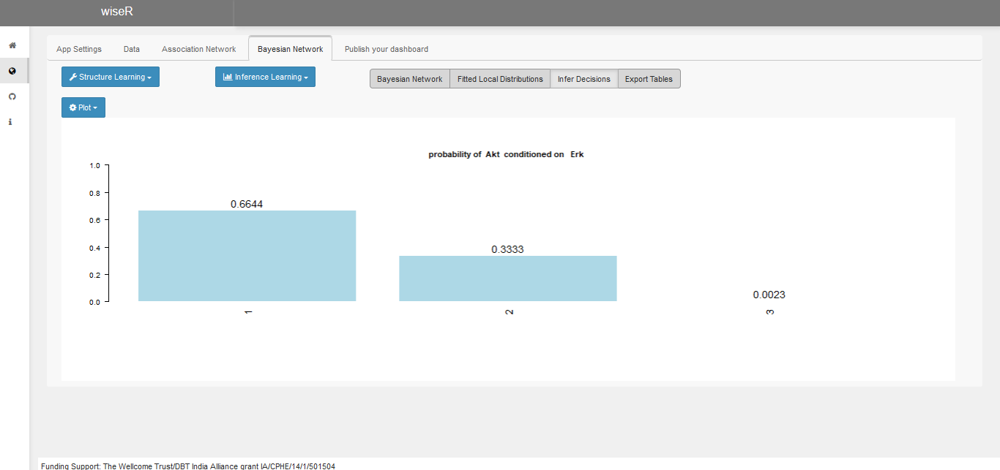

Approximate Inference with error bars


# Powered by

The wiseR engine depends upon the following awesome libraries

* *RBGL* (Vince Carey, Li Long and R. Gentleman (2017). RBGL: An interface to the BOOST graph library.
  R package version 1.52.0. http://www.bioconductor.org)
* *graph* (R. Gentleman, Elizabeth Whalen, W. Huber and S. Falcon (2017). graph: graph: A package to
  handle graph data structures. R package version 1.54.0.)
* *bnlearn* (Marco Scutari (2010). Learning Bayesian Networks with the bnlearn R Package. Journal of
  Statistical Software, 35(3), 1-22. URL http://www.jstatsoft.org/v35/i03/.)
* *rhandsontable* (Jonathan Owen (2018). rhandsontable: Interface to the 'Handsontable.js' Library. R   package version 0.3.6. https://CRAN.R-project.org/package=rhandsontable)
* *shiny* (Winston Chang, Joe Cheng, JJ Allaire, Yihui Xie and Jonathan McPherson (2017). shiny: Web
  Application Framework for R. R package version 1.0.5. https://CRAN.R-project.org/package=shiny)
* *shinydashboard* (Winston Chang and Barbara Borges Ribeiro (2017). shinydashboard: Create Dashboards   with 'Shiny'. R package version 0.6.1. https://CRAN.R-project.org/package=shinydashboard)
* *dplyr* (Hadley Wickham, Romain Francois, Lionel Henry and Kirill Müller (2017). dplyr: A Grammar of
  Data Manipulation. R package version 0.7.4. https://CRAN.R-project.org/package=dplyr)
* *visNetwork* (Almende B.V., Benoit Thieurmel and Titouan Robert (2018). visNetwork: Network             Visualization using 'vis.js' Library. R package version 2.0.3.
  https://CRAN.R-project.org/package=visNetwork)
* *shinyWidgets* (Victor Perrier and Fanny Meyer (2018). shinyWidgets: Custom Inputs Widgets for        Shiny. R package version 0.4.1. https://CRAN.R-project.org/package=shinyWidgets)
* *missRanger* (Michael Mayer (2018). missRanger: Fast Imputation of Missing Values. R package version
  1.0.2. https://CRAN.R-project.org/package=missRanger)
* *tools* (R Core Team (2017). R: A language and environment for statistical computing. R Foundation
  for Statistical Computing, Vienna, Austria. URL https://www.R-project.org/.)
* *shinyalert* (Dean Attali and Tristan Edwards (2018). shinyalert: Easily Create Pretty Popup          Messages (Modals) in 'Shiny'. R package version 1.0. https://CRAN.R-project.org/package=shinyalert)
* *shinycssloaders* (Andras Sali (2017). shinycssloaders: Add CSS Loading Animations to 'shiny'         Outputs. R package version 0.2.0. https://CRAN.R-project.org/package=shinycssloaders)
* *rintrojs* (Carl Ganz (2016). rintrojs: A Wrapper for the Intro.js Library. Journal of Open Source
  Software, 1(6), October 2016. URL http://dx.doi.org/10.21105/joss.00063)
* *arules* (Michael Hahsler, Christian Buchta, Bettina Gruen and Kurt Hornik (2018). arules: Mining
  Association Rules and Frequent Itemsets. R package version 1.6-1.
  https://CRAN.R-project.org/package=arules)
* *psych* (Revelle, W. (2018) psych: Procedures for Personality and Psychological Research,
  Northwestern University, Evanston, Illinois, USA, https://CRAN.R-project.org/package=psych
  Version = 1.8.4.)
* *DescTools* (Andri Signorell et mult. al. (2018). DescTools: Tools for descriptive statistics. R      package version 0.99.24.)
* *DT* (Yihui Xie (NA). DT: A Wrapper of the JavaScript Library 'DataTables'. R package version
  0.4.11. https://rstudio.github.io/DT)
* *linkcomm* (Kalinka, A.T. and Tomancak, P. (2011). linkcomm: an R package for the generation,
  visualization, and analysis of link communities in networks of arbitrary size and type.
  Bioinformatics 27 (14), 2011-2012.)
* *igraph* (Csardi G, Nepusz T: The igraph software package for complex network research,               InterJournal, Complex Systems 1695. 2006. http://igraph.org)
* *parallel* (R Core Team (2017). R: A language and environment for statistical computing. R            Foundation for Statistical Computing, Vienna, Austria. URL https://www.R-project.org/.)
* *snow* (Luke Tierney, A. J. Rossini, Na Li and H. Sevcikova (2016). snow: Simple Network of
  Workstations. R package version 0.4-2. https://CRAN.R-project.org/package=snow)
* *shinyBS* (Eric Bailey (2015). shinyBS: Twitter Bootstrap Components for Shiny. R package version     0.61. https://CRAN.R-project.org/package=shinyBS)
* *gRbase* (Claus Dethlefsen, Søren Højsgaard (2005). A Common Platform for Graphical Models in R: The
  gRbase Package. Journal of Statistical Software, 14(17), 1-12. URL
  http://www.jstatsoft.org/v14/i17/.)
* *gRain* (Søren Højsgaard (2012). Graphical Independence Networks with the gRain Package for R.
  Journal of Statistical Software, 46(10), 1-26. URL http://www.jstatsoft.org/v46/i10/.)


